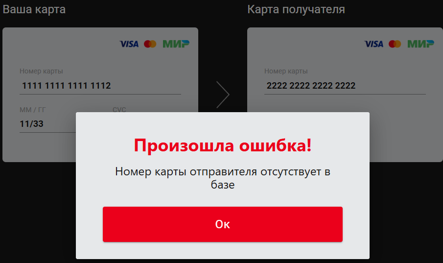
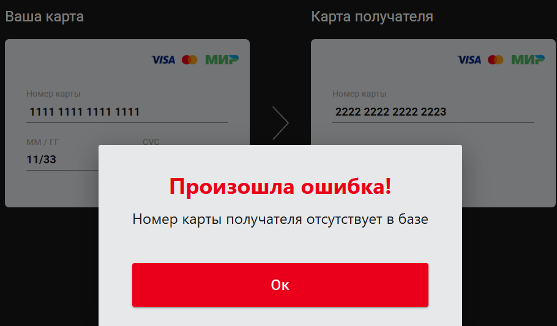
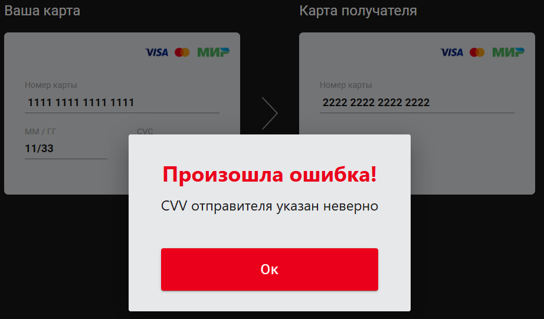
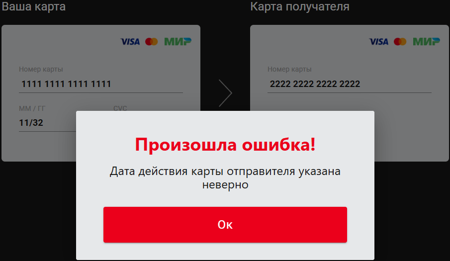
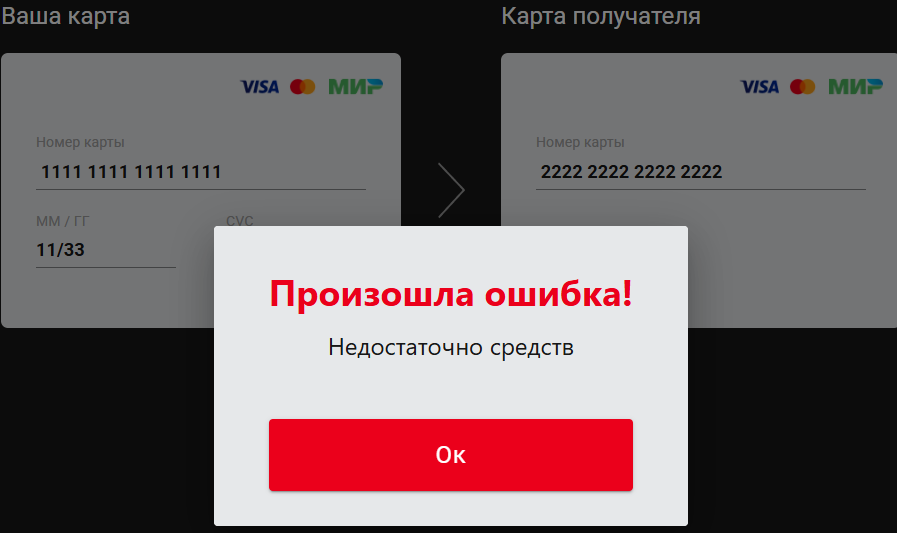

# Сервис перевода денег

Необходимо разработать **_REST-сервис_**, который должен предоставить интерфейс для перевода денег с одной карты на другую по заранее описанной спецификации.
Заранее подготовленное веб-приложение (**_FRONT_**) должно подключаться к разработанному сервису без доработок и использовать его функционал для перевода денег.

  **_FRONT_** демо: https://serp-ya.github.io/card-transfer/

### Требования к приложению

- Сервис должен предоставлять **_REST-интерфейс_** для интеграции с FRONT.
- Сервис должен реализовывать все методы перевода с одной банковской карты на другую, описанные в протоколе **_MoneyTransferServiceSpecification.yaml_**.
- Все изменения должны записываться в файл - лог переводов в произвольном формате с указанием:
  даты; времени; карты, с которой было списание; карты зачисления; суммы; комиссии; результата операции, если был.

### Требования в реализации

- Разработать приложение с использованием **_Spring Boot_**.
- Использовать сборщик пакетов **_gradle/maven_**.
- Для запуска используются **_Docker_**, **_Docker Compose_**.
- Код разместить на **_GitHub_**.
- Код покрыть **_JUnit-тестами_** с использованием **_Mockito_**.
- Добавить интеграционные тесты с использованием **_TestContainers_**.

### Описание интеграции с FRONT

FRONT доступен по адресу https://github.com/serp-ya/card-transfer или в папкке **_card-transfer_**.
Можно скачать репозиторий или использовать уже развёрнутое демо-приложение по адресу https://serp-ya.github.io/card-transfer/ (тогда ваш API должен быть запущен по адресу http://localhost:5500/).

### Запуск приложения

- Собираем **_jar_** архив с нашим **_Spring Boot_** приложением в терминале: `./mvn clean package` (или в интерфейсе **Maven**)
- Для создания образа из Dockerfile запускаем: `docker build -t moneytransferapp:latest -t moneytransferapp:4.0 .   `
- Поднимаем контейнер: `docker-compose up`

### Валидации

На стороне клиента: Описание web-интерфейса можно посмотреть [тут](https://github.com/PoddubniySerg/MoneyTransferApp/blob/master/WebClient/card-transfer-master/README.md).

- Номер карты - минимум 16 знаков.
- ММ/ГГ - минимум 5 знаков.
- CVC - минимум 3 знака.
- Сумма перевода - не может быть равное или меньше 0
- Реализация поддерживает только перевод в рублях.

Все поля обязательные для заполнения.

На стороне сервера:
- Номера карт и получателя и отправителя должны быть в базе данных

   

  

- CVV, MM/ГГ отправителя должны совпадать с данными в базе

  

  

- Сумма перевода не должна превышать сумму на счету отправителя

   

